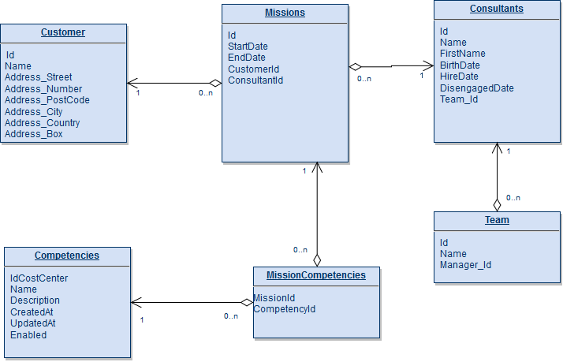

# Csharp Training
## Information
### Database diagram

## Some tips
Location of where you have to fix or add some code are marked with Todos. Visual Studio has a 'Task List' windows that allows you to easily find theses todos. 
## Exercice 1 : Linq - Where clause
### 1.1 Search consultant
Users want to filter consultant based on their name and firstname(partial). Your colleague tried to implement it but it seems that the code always returns all records... 
You have to fix his code in order to make it work

### 1.2 Search consultant by team name
Users wants to search consultant based on their team name(exact name). You have to add the functionnality in the search action.

## Exercice 2 : Linq - Aggregations
Management would like a dashboard with real time company information such as:
* number of consultant without a mission
* Number of hired employee each years
* Top 5 clients
* 3 Newest missions

As the dashboard will be available in a web application you have to implement a Dashboard rest service.

### 2.1: number of consultant without a mission
You must provide the number of consultants that do not have an active mission at the moment. 
TIPS: Unemployed = No mission at all or all missions done.

### 2.2: Top 5 clients
Provide biggest clients in terms of current active mission number.
TIPS: Start from db.Missions

### 2.3: 3 Newest missions
Provide the 3 latest missions. You must provide:
Consultant FullName, Customer Name, Customer country, Mission Start Date

Results must be ordered by mission Start date

## Exercice 3: async
Company use a small winform application to generate contracts as pdf. That application has some issues we ask you to resolve

Foo and Bar developped this application (Foo did ContosoConsultancy.ContractGenerator.UI and Bar ContosoConsultancy.ContractGenerator.Core)

### 3.1 PDF Generation too slow

Users are complaining about huge pdf generation time.

Bar explained that on his side everything is ok but he created an async method on ContractService. Foo asks you to use this method as it should improve responsivity of the app.

### 3.2 PDF Generation still too slow

Foo was pretty sure using async will help responsivness. Bar explained you that Foo do not understand how async works and there is probably some issues on his code. 

Bar asks you to review the code and adapt it to make it work correctly (using async methods)

### 3.3 Improve start time

Users would like to improve application start time. Foo asks you to show Form faster so that users can already encode some data even if everthing is not loaded yet.

## Additionnal exercices

### 4.0 Slow web service
The webservice was made slow on purpose (ensure async will be useful). How do you think this has been done ?

## 4 Extra Linq Aggregation
### 4.1 Number of hired employee each year
You must provide a map where key is year and value is the number of employee hired that year
If there is no employee we want an item in the map with value 0